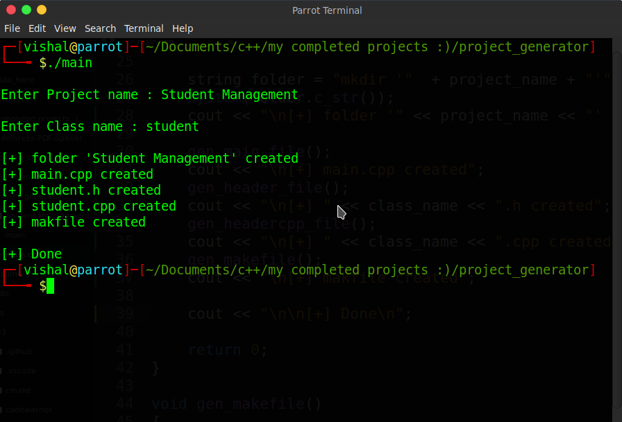
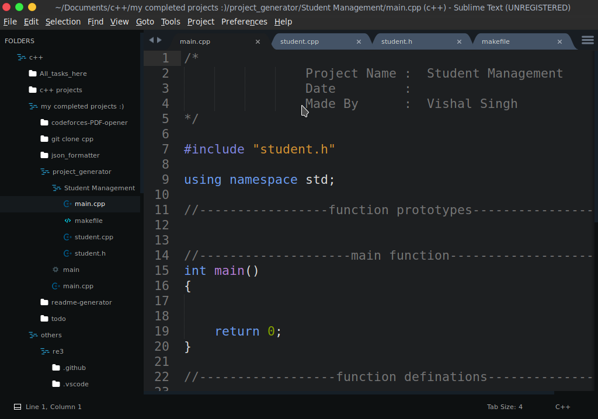
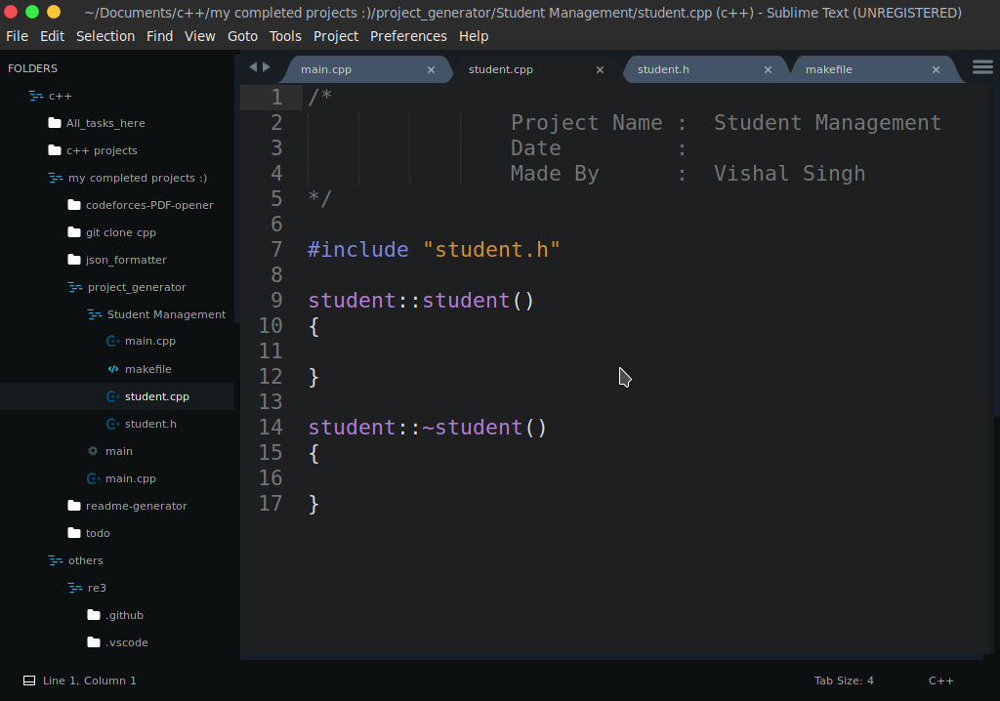
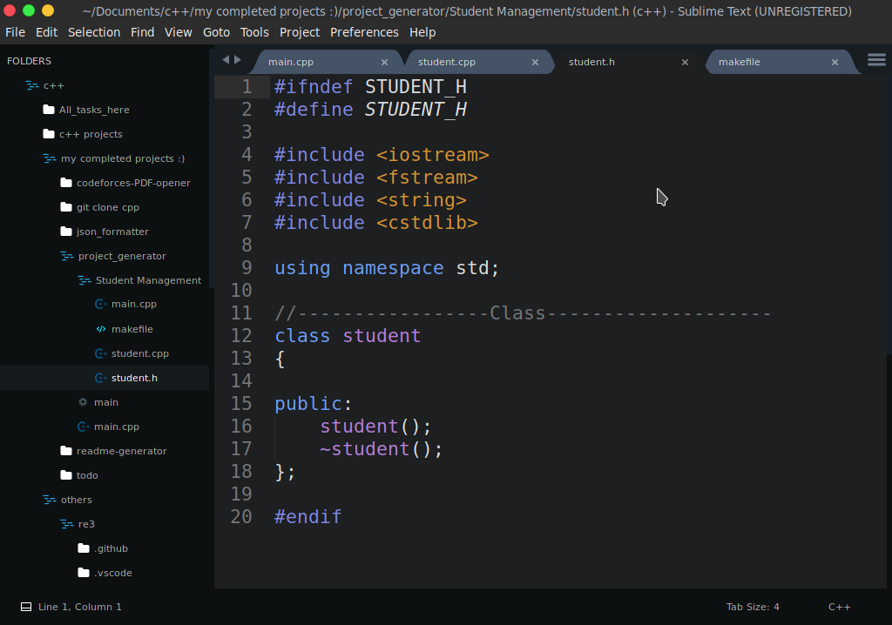
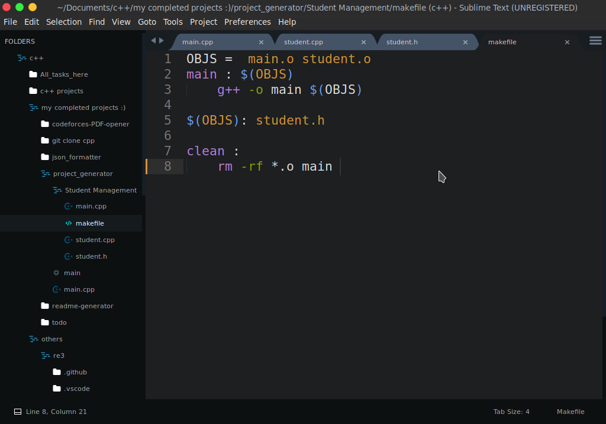

# C++ Project Template Generator

Genrate a basic project code template along with makefile and header files

<p align="center">
	<a href="https://github.com/vishal2376/project-template/issues">
	
	</a>
	<a href="https://github.com/vishal2376/project-template/stargazers">
	
	</a>
	<a href="https://github.com/vishal2376/project-template/blob/master/LICENSE">
	
	</a>
</p>


## Build and Run

```bash
  git clone  https://github.com/vishal2376/project-template
  cd project-template
  make
  ./main
```


## Screeshots :



- main.cpp



- student.h



- student.cpp



- makefile




## More projects : 

 - [Virtual Assistant](https://github.com/vishal2376/virtual-assistant)
 - [C++ Mini Projects](https://github.com/vishal2376/cpp-mini-projects)
 - [Telegram Bot](https://github.com/vishal2376/telegram-bot)


## Contacts :  

 - [Instagram](https://www.instagram.com/vishal_2376/)
 - [Telegram](https://t.me/vishal2376/)
 - [Join Telegram group](https://t.me/cppwithtricks)